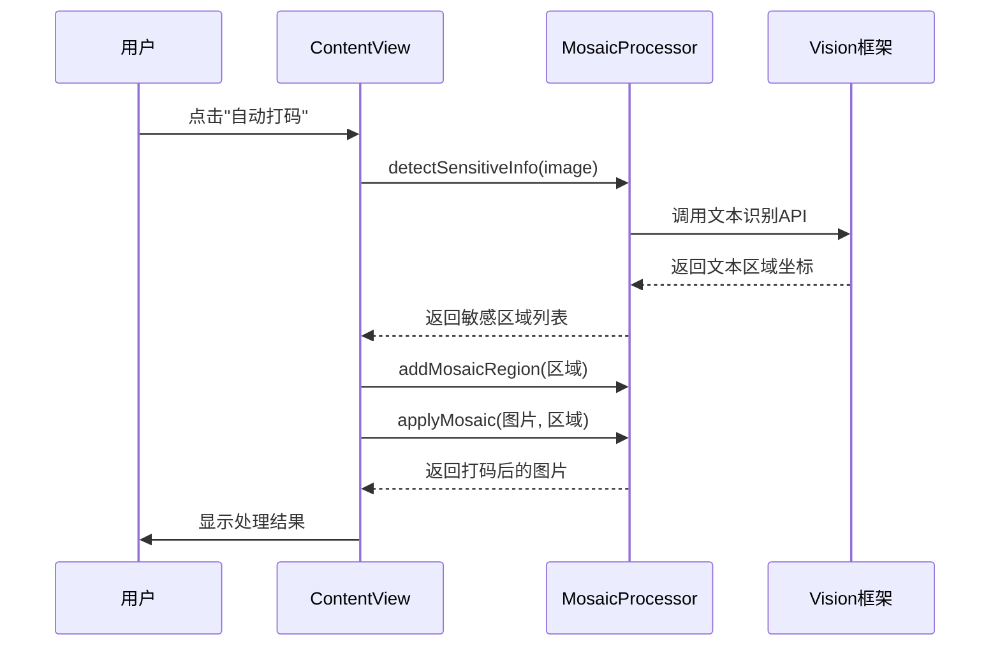
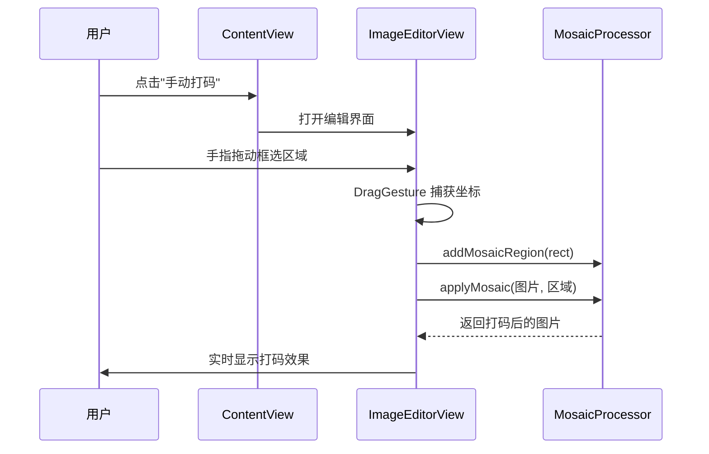

# 打码功能技术文档

## 📋 目录
1. [项目概述](#项目概述)
2. [核心架构](#核心架构)
3. [自动打码原理](#自动打码原理)
4. [手动打码原理](#手动打码原理)
5. [马赛克算法详解](#马赛克算法详解)
6. [调试指南](#调试指南)

---

## 项目概述

**dama** 是一个 iOS 离线图片打码应用，支持自动检测敏感信息并打码，也支持手动框选区域打码。

### 主要功能
- ✅ 自动检测文本区域并打码（基于 OCR）
- ✅ 手动框选区域打码
- ✅ 取消打码功能
- ✅ 支持批量处理多张图片（最多5张）

---

## 核心架构

### 文件结构
```
dama/
├── ContentView.swift          # 主界面：图片展示、工具按钮
├── ImageEditorView.swift      # 编辑界面：手动框选、区域管理
└── MosaicProcessor.swift      # 核心处理器：马赛克算法、文本检测
```

### 数据流转图
```
┌─────────────┐
│ 用户上传图片 │
└──────┬──────┘
       │
       ▼
┌─────────────────────┐
│  ContentView        │
│  - 图片列表管理      │
│  - 工具按钮控制      │
└──────┬──────────────┘
       │
       ├──────► 自动打码 ──────┐
       │                       │
       └──────► 手动打码 ──────┤
                               │
                               ▼
                    ┌──────────────────┐
                    │ MosaicProcessor  │
                    │ - OCR 文本检测   │
                    │ - 马赛克算法     │
                    └────────┬─────────┘
                             │
                             ▼
                    ┌─────────────────┐
                    │  处理后的图片    │
                    └─────────────────┘
```

---

## 自动打码原理

### 工作流程



### 核心代码位置

#### 1. 触发自动打码 (`ContentView.swift:212-248`)
```swift
private func activateAutoMosaic() {
    isAutoMosaicActive = true
    isManualModeActive = false

    // 遍历所有图片
    for (index, image) in loadedImages.enumerated() {
        // 调用检测
        mosaicProcessor.detectSensitiveInfo(in: image) { regions in
            // 清除旧区域
            mosaicProcessor.clearAllRegions()

            // 添加检测到的区域
            for region in regions {
                mosaicProcessor.addMosaicRegion(region, intensity: .high)
            }

            // 应用马赛克
            if let processedImage = mosaicProcessor.applyMosaic(to: image, regions: mosaicProcessor.mosaicRegions) {
                self.processedImages[index] = processedImage
            }
        }
    }
}
```

#### 2. 文本检测 (`MosaicProcessor.swift:181-225`)
使用 Apple 的 **Vision 框架** 进行 OCR 文本识别：

```swift
func detectText(in image: UIImage, completion: @escaping ([CGRect]) -> Void) {
    let request = VNRecognizeTextRequest { request, error in
        guard let observations = request.results as? [VNRecognizedTextObservation] else {
            completion([])
            return
        }

        // 转换坐标系（Vision坐标系 → UIKit坐标系）
        let textRegions = observations.compactMap { observation -> CGRect? in
            let boundingBox = observation.boundingBox
            return CGRect(
                x: boundingBox.origin.x,
                y: 1 - boundingBox.origin.y - boundingBox.height,
                width: boundingBox.width,
                height: boundingBox.height
            )
        }

        completion(textRegions)
    }

    // 配置识别参数
    request.recognitionLevel = .fast  // 快速识别模式
    request.usesLanguageCorrection = false  // 不使用语言纠正

    // 执行识别
    let handler = VNImageRequestHandler(cgImage: cgImage, options: [:])
    try handler.perform([request])
}
```

### 关键技术点

| 技术 | 说明 |
|------|------|
| **Vision 框架** | Apple 官方 OCR 引擎，支持离线文本识别 |
| **坐标系转换** | Vision 使用左下角原点，UIKit 使用左上角原点，需要转换 |
| **异步处理** | 文本检测在后台线程执行，完成后回调主线程 |

---

## 手动打码原理

### 工作流程



### 核心代码位置

#### 1. 手动框选覆盖层 (`ImageEditorView.swift:175-235`)

```swift
struct ManualSelectionOverlay: View {
    @Binding var currentSelection: CGRect?
    @Binding var isSelecting: Bool
    @Binding var startPoint: CGPoint

    var body: some View {
        GeometryReader { geometry in
            ZStack {
                // 半透明遮罩
                Color.black.opacity(0.3)

                // 当前框选区域
                if let selection = currentSelection {
                    Rectangle()
                        .stroke(Color.blue, lineWidth: 2)
                        .background(Color.blue.opacity(0.1))
                        .frame(
                            width: selection.width * geometry.size.width,
                            height: selection.height * geometry.size.height
                        )
                }
            }
            .gesture(
                DragGesture()
                    .onChanged { value in
                        // 记录起点
                        if !isSelecting {
                            startPoint = value.startLocation
                            isSelecting = true
                        }

                        // 计算矩形区域（归一化坐标 0-1）
                        let currentPoint = value.location
                        let rect = CGRect(
                            x: min(startPoint.x, currentPoint.x) / geometry.size.width,
                            y: min(startPoint.y, currentPoint.y) / geometry.size.height,
                            width: abs(currentPoint.x - startPoint.x) / geometry.size.width,
                            height: abs(currentPoint.y - startPoint.y) / geometry.size.height
                        )
                        currentSelection = rect
                    }
                    .onEnded { _ in
                        // 框选完成，添加打码区域
                        if let selection = currentSelection,
                           selection.width > 0.02 && selection.height > 0.02 {
                            onSelectionComplete(selection)
                        }
                        currentSelection = nil
                        isSelecting = false
                    }
            )
        }
    }
}
```

### 关键技术点

| 技术 | 说明 |
|------|------|
| **SwiftUI DragGesture** | 捕获手势拖动，实时计算框选矩形 |
| **归一化坐标** | 坐标值为 0-1 范围，与图片实际尺寸无关 |
| **实时预览** | 每次坐标变化立即刷新界面，提供视觉反馈 |
| **最小区域检测** | 过滤掉宽高小于 2% 的误触区域 |

---

## 马赛克算法详解

### 像素化原理

马赛克本质是**降低图像分辨率**，将多个像素块合并为一个颜色。

```
原始图片 (高清)          马赛克图片 (模糊)
┌─┬─┬─┬─┐              ┌───┬───┐
│A│B│C│D│              │ E │ F │
├─┼─┼─┼─┤      →       │   │   │
│E│F│G│H│              ├───┼───┤
├─┼─┼─┼─┤              │ G │ H │
│I│J│K│L│              │   │   │
└─┴─┴─┴─┘              └───┴───┘

E = avg(A,B,E,F)  # 计算 2x2 块的平均颜色
```

### 核心算法 (`MosaicProcessor.swift:80-114`)

```swift
private func applyMosaicToRegion(context: CGContext, region: MosaicRegion, imageSize: CGSize) {
    let blockSize = 20  // 固定 20x20 像素块（最高模糊度）

    // 转换坐标系（UIKit → CoreGraphics）
    let flippedRect = CGRect(
        x: rect.origin.x * imageSize.width,
        y: (1 - rect.origin.y - rect.height) * imageSize.height,
        width: rect.width * imageSize.width,
        height: rect.height * imageSize.height
    )

    // 遍历每个像素块
    for y in stride(from: startY, to: endY, by: blockSize) {
        for x in stride(from: startX, to: endX, by: blockSize) {
            let blockRect = CGRect(x: x, y: y, width: blockSize, height: blockSize)

            // 1. 计算该块的平均颜色
            if let averageColor = getAverageColor(context: context, rect: blockRect) {
                // 2. 用平均颜色填充整个块
                context.setFillColor(averageColor)
                context.fill(blockRect)
            }
        }
    }
}
```

### 平均颜色计算 (`MosaicProcessor.swift:116-155`)

```swift
private func getAverageColor(context: CGContext, rect: CGRect) -> CGColor? {
    let pixelData = context.data  // 获取像素数据

    var totalR = 0, totalG = 0, totalB = 0, totalA = 0
    var pixelCount = 0

    // 遍历块内所有像素
    for y in startY..<endY {
        for x in startX..<endX {
            let pixelIndex = y * bytesPerRow + x * bytesPerPixel
            let pixel = pixelData.assumingMemoryBound(to: UInt8.self)

            totalR += Int(pixel[pixelIndex])      // Red
            totalG += Int(pixel[pixelIndex + 1])  // Green
            totalB += Int(pixel[pixelIndex + 2])  // Blue
            totalA += Int(pixel[pixelIndex + 3])  // Alpha
            pixelCount += 1
        }
    }

    // 计算平均值
    let avgR = CGFloat(totalR) / CGFloat(pixelCount) / 255.0
    let avgG = CGFloat(totalG) / CGFloat(pixelCount) / 255.0
    let avgB = CGFloat(totalB) / CGFloat(pixelCount) / 255.0
    let avgA = CGFloat(totalA) / CGFloat(pixelCount) / 255.0

    return CGColor(red: avgR, green: avgG, blue: avgB, alpha: avgA)
}
```

### 算法流程图

```
开始
  │
  ▼
遍历打码区域
  │
  ▼
划分 20x20 像素块
  │
  ▼
计算每块的平均颜色
  │  │
  │  ├─ 累加所有像素的 R、G、B、A 值
  │  └─ 除以像素数得到平均值
  │
  ▼
用平均颜色填充该块
  │
  ▼
所有块处理完成？
  │           │
  否          是
  │           │
  │           ▼
  └────►   返回处理后的图片
```

---

## 调试指南

### 常见问题排查

#### 1️⃣ 自动打码没有检测到文本

**可能原因：**
- 图片分辨率太低
- 文字太小或模糊
- 光照条件不佳

**调试方法：**
```swift
// 在 detectText 方法中添加日志
func detectText(in image: UIImage, completion: @escaping ([CGRect]) -> Void) {
    let request = VNRecognizeTextRequest { request, error in
        guard let observations = request.results as? [VNRecognizedTextObservation] else {
            print("❌ 未检测到文本")
            completion([])
            return
        }

        print("✅ 检测到 \(observations.count) 个文本区域")
        for (index, obs) in observations.enumerated() {
            print("区域 \(index): \(obs.boundingBox)")
        }

        // ... 后续代码
    }
}
```

**解决方案：**
- 调整 `recognitionLevel` 为 `.accurate`（更慢但更准确）
- 增强图片对比度预处理

---

#### 2️⃣ 手动框选区域不准确

**可能原因：**
- 坐标系转换错误
- 图片缩放导致坐标偏移

**调试方法：**
```swift
// 在 ManualSelectionOverlay 中打印坐标
.onEnded { _ in
    if let selection = currentSelection {
        print("框选区域（归一化）: \(selection)")
        print("框选区域（像素）: x=\(selection.x * imageSize.width), y=\(selection.y * imageSize.height)")
    }
}
```

---

#### 3️⃣ 马赛克效果不明显

**可能原因：**
- `blockSize` 太小
- 区域面积太小

**解决方案：**
```swift
// 调整 MosaicIntensity 的像素块大小
enum MosaicIntensity: Int, CaseIterable {
    case high = 30  // 从 20 增加到 30，更模糊
}
```

---

#### 4️⃣ 处理大图片时卡顿

**优化方案：**
```swift
// 在后台线程处理马赛克
DispatchQueue.global(qos: .userInitiated).async {
    if let processedImage = mosaicProcessor.applyMosaic(to: image, regions: regions) {
        DispatchQueue.main.async {
            self.processedImages[index] = processedImage
        }
    }
}
```

---

### 调试工具推荐

| 工具 | 用途 |
|------|------|
| **Xcode Instruments** | 性能分析、内存泄漏检测 |
| **po 命令** | 在断点处打印变量 `po mosaicRegions` |
| **View Hierarchy Debugger** | 检查 UI 层级和布局 |
| **Simulator Camera** | 模拟相机拍摄测试 |

---

### 关键断点位置

推荐在以下位置设置断点：

1. **自动检测回调**：`ContentView.swift:225`
   ```swift
   mosaicProcessor.detectSensitiveInfo(in: image) { regions in
       // 断点：检查检测到的区域数量
   }
   ```

2. **马赛克应用**：`MosaicProcessor.swift:48`
   ```swift
   func applyMosaic(to image: UIImage, regions: [MosaicRegion]) -> UIImage? {
       // 断点：检查区域参数
   }
   ```

3. **手动框选完成**：`ImageEditorView.swift:221`
   ```swift
   .onEnded { _ in
       // 断点：检查框选坐标
   }
   ```

---

## 附录：坐标系转换说明

### Vision 坐标系 vs UIKit 坐标系

```
Vision 坐标系               UIKit 坐标系
(左下角为原点)              (左上角为原点)

  ↑ y                         → x
  │                           ↓ y
  │    ┌─────┐                ┌─────┐
  │    │     │                │     │
  │    └─────┘                └─────┘
  └───────→ x
```

### 转换公式

```swift
// Vision → UIKit
let uiKitY = 1 - visionY - visionHeight

// CoreGraphics (左下) → UIKit (左上)
let uiKitY = (1 - rect.origin.y - rect.height) * imageSize.height
```

---

## 快速上手 Checklist

- [ ] 理解 `ContentView`、`ImageEditorView`、`MosaicProcessor` 三个文件的职责
- [ ] 掌握 Vision 框架的基本用法
- [ ] 理解归一化坐标系（0-1 范围）
- [ ] 熟悉马赛克算法的像素块平均颜色计算
- [ ] 学会使用 Xcode 调试工具排查问题
- [ ] 了解 SwiftUI 的 `@State`、`@Binding`、`@Published` 状态管理

---

**文档版本：** v1.0
**最后更新：** 2025-10-03
**维护者：** dama 开发团队
